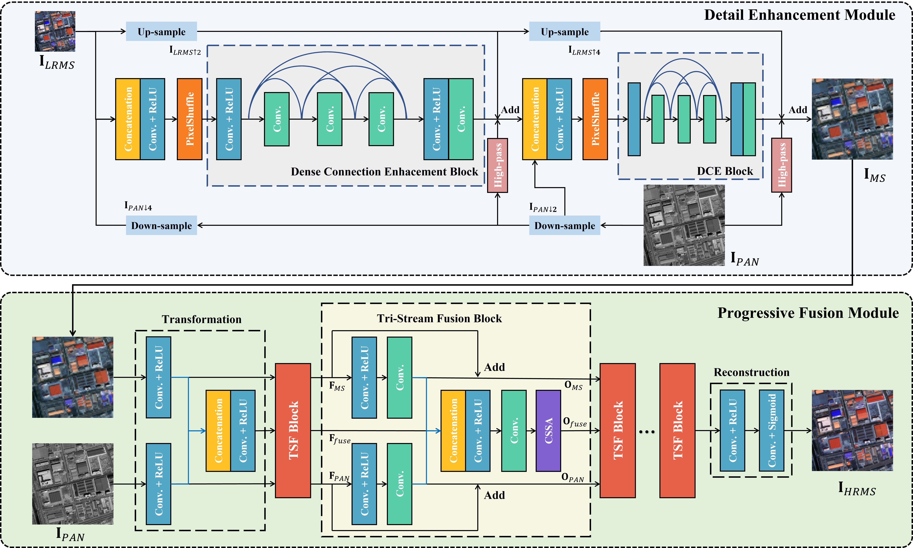

# PAPS
This is the PyTorch implementation of paper "PAPS: Progressive Attention-based Pan-sharpening".

## Build Your Datasets

Before running the codes, you should modify the input path in codes according to your datasets. The related codes of this part are all in 'process_data' folder.

You can generate your datasets as follows:
```
cd process_data
python real_processing.py
python to_patch.py
```

## Train the Model

You can just modify the args in args.py and run
```
python train.py
```
The logs and the model will be saved in the 'log' and 'checkpoint' folders respectively.

## Test the Model

You can just modify the args in testsolver.py and run
```
python test.py
```
Generally the results will be generated below the 'output' folder.

## Main Architecture



## Dependencies
```
Ubuntu 16.04.6 LTS
Python 3.7.0
```
main python packages:
```
gdal = 2.3.2
pytorch = 1.9.1     
torchvision = 0.10.1
opencv-python = 4.5.3.56
cudatoolkit = 11.1.74
```
